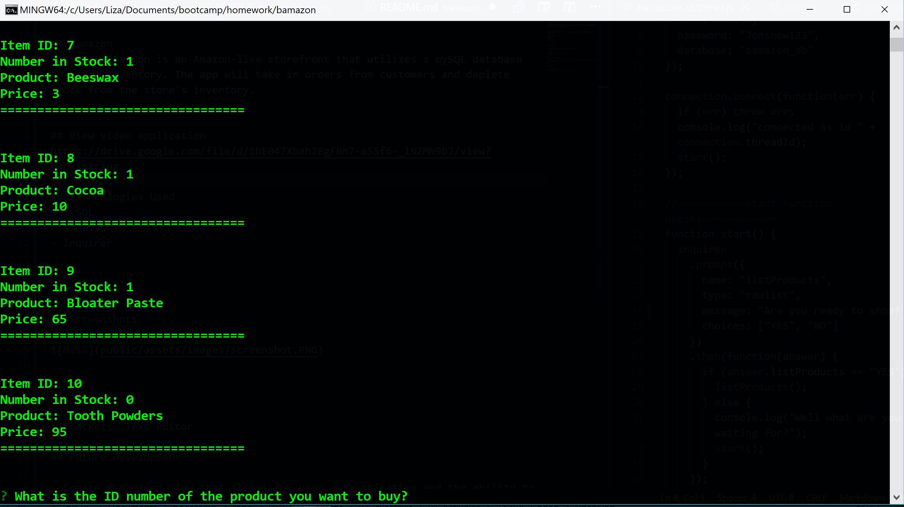

## Bamazon
This application is an Amazon-like storefront that utilizes a mySQL database to track inventory. The app will take in orders from customers and deplete stock from the store's inventory.

## View video of application
https://drive.google.com/file/d/1hE047Xbah28gF0h7-aS5f6-_1NZMN9bJ/view?usp=sharing

## Technologies Used
- mySQL
- Node.Js
- Inquirer 

## Screenshots

## Built With

- Brackets- Text Editor

## Future Development

- Create a manager view that allows for user authentication and the ability to add inventory.

## Authors

* Alycia Riley
* [www.code-retro.com](http://www.code-retro.com)

